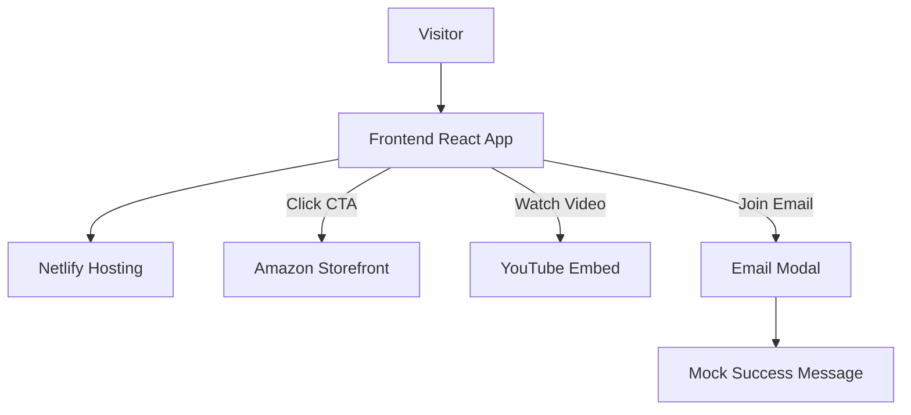

# RougeStoryWorld - System Architecture

## 🎯 Purpose

RougeStoryWorld was built as a **professional marketing landing page** for an independent audiobook creator.
Its role is to provide a **clean, conversion-oriented front-end** that:

* Showcases featured books with ratings, covers, and Amazon links
* Embeds YouTube promotional videos
* Provides an author biography with trust signals
* Highlights testimonials from readers
* Captures basic email interest (mocked, not production)
* Directs all purchases to Amazon’s storefront

---

## 🛠 Core Architecture Overview

The system is a **static frontend application** deployed on Netlify with React + Vite.
All eCommerce and payments are **offloaded to Amazon**, meaning no backend integration was required.

### 🔹 Frontend (React + Vite)

* React 19 + Vite bundler
* `react-router-dom` for routing
* Pages:

  * `/` → Landing page (Hero, Books, Video, About, Testimonials, Email, Footer)
  * `/collection` → Full book collection
* Tailwind CSS for styling
* Framer Motion for subtle animations

### 🔹 Backend

There is **no custom backend**.

* Supabase integration was originally scaffolded but removed for production-readiness.
* Email collection now simulates a signup flow without storing data.

### 🔹 Hosting & Infrastructure

* **Hosting:** Netlify (CI/CD from GitHub)
* **Assets:** Stored under `public/` (logos, covers, profile images)
* **External Links:** Amazon Author Page + YouTube embeds

---

## 🔗 System Data Flow



---

## 🧩 Subsystem Breakdown
```text
| Subsystem      | Implementation               | Purpose                                          |
| -------------- | ---------------------------- | ------------------------------------------------ |
| frontend\_ui   | React + Vite + Tailwind      | Public-facing site for marketing and conversions |
| routing        | React Router DOM             | Navigation between home and collection pages     |
| styling        | Tailwind CSS + Framer Motion | Modern UI, animations, responsiveness            |
| email\_capture | Local state only             | Simulated popup for signup interest              |
| integrations   | Amazon Storefront + YouTube  | External purchase + video hosting                |
| hosting        | Netlify                      | Deployment and CI/CD pipeline                    |
```

---

## ⚡ Architecture Strengths

* **Simplicity:** No backend maintenance; relies on Amazon for eCommerce.
* **Scalable:** Static React + Netlify hosting scales automatically.
* **Professional polish:** Designed for readability, recruiter review, and client-facing use.
* **Extensible:** Could be expanded later with backend email lists or direct checkout.
